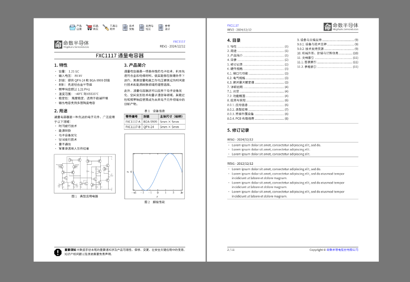

# tids: A TI-Style Datasheet Template for Typst

[English](README.md) | 简体中文

本项目是一个出于演示和评估的目的创建的 TI 风格电子元件规格书模板。



**如果你觉得本项目有用请点亮小星星。**

## 声明

本开源项目出于演示和评估的目的创建，并无意侵犯任何版权和商标。作者与 TI 并无任何关联。

## 特性

- **简单易学：** 使用 Typst 易于编写和阅读，如果你会编写 Markdown，那 Typst 没太大的不同。
- **可自定义：** 模板完全开源，你可以完全自定义，这里的 TI 风格只是个例子。
- **编译飞快：** 一两秒即可编译输出 PDF，而不是 LaTeX 需要的几分钟甚至更久。

## 快速上手

0. 如果你还没有 Typst 就先安装：
    ```powershell
    winget install --id Typst.Typst
    ```
1. 克隆本仓库到本地
   ```bash
   git clone https://github.com/oldrev/tids.git
   ```
3. 构建示例 PDF 文件：
    ```bash
    typst compile demo-ds.zh.typ
    ```
4. 赏玩生成的 [`demo-ds.zh.pdf`](demo-ds.zh.pdf) PDF 文件。

## 使用

1. 把模板文件 `tsds.typ` 复制到你的项目目录里。
2. 导入模板文件并调用 `tids()` 函数：
    ```typst
    #import "tids.typ": tids, ds_tablex_styles

    #show: doc => tids(ds_metadata: (
            title: [YourDSTitle],
            product: [YourProductName],
            product_url: "https://github.com/oldrev/tids",
            revision: [CurrentRevision],
            publish_date: [PublishedOn]
        ),
        features: [features for the title page],
        applications: [application information for the title page],
        desc: [description content for the title page],
        rev_list: [revision list],
        doc: doc
    )
    // ... The content of your document
    ```
    See [`demo-ds.zh.typ`](demo-ds.zh.typ) for details.


## 演示视频

- Youtube: TODO
- 哔哩哔哩: TODO

## 参与贡献

发现任何 bugs 或者有任何改进建议请不要犹豫，赶紧发 Issue 和 PR。

## 授权协议

本项目使用 Apache 2.0 协议授权.